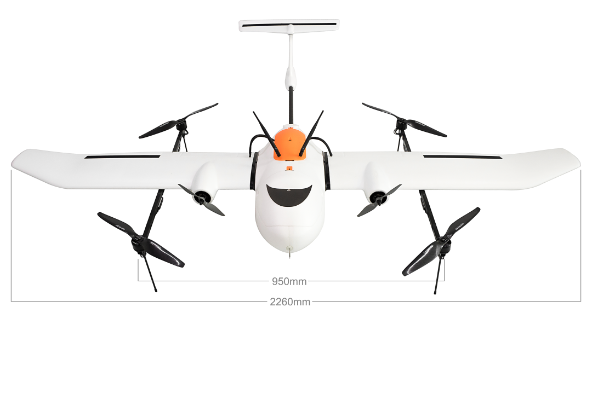
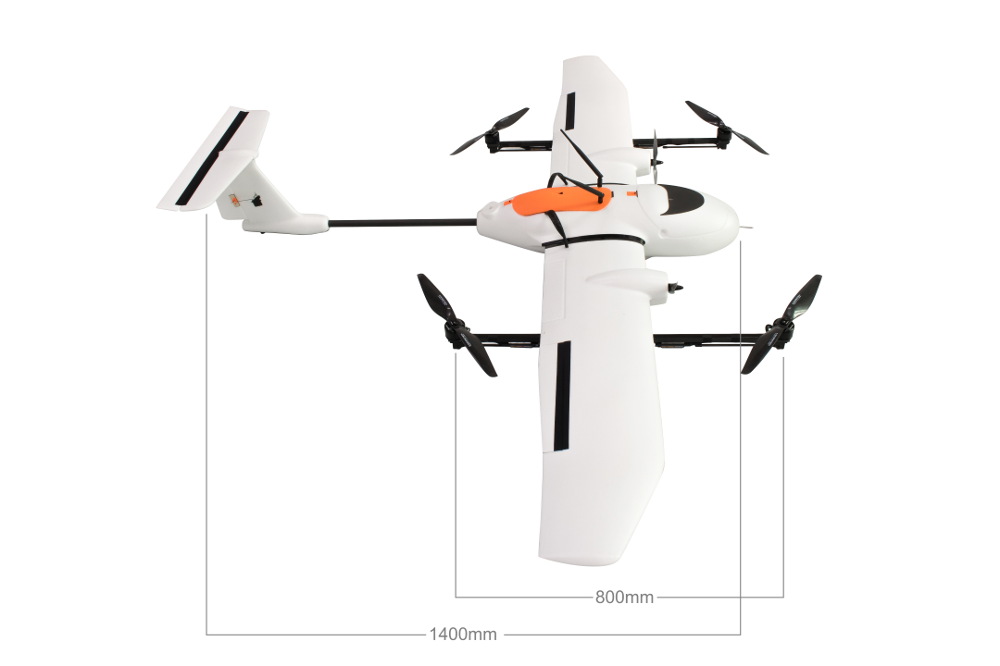

# Hummingbird 1.0
The [Hummingbird](http://global.parrot.com/au/products/bebop2/) is an affordable VTOL platform created for industrial applications. The default platform is compatible with PX4 VTOL firmware.

## Video
Introduction
https://youtu.be/8EQBER6SiPU 

Quick assembly guide
https://youtu.be/poj2kVe34r4 

## Specs
* Wingspan: 2.3m
* Length: 1.5m
* Empty weight: 4.2kg
* Max takeoff weight: 8kg
* Payload capacity: 3.8kg (including battery)

## Where to Buy

* [Vertek official store](https://www.vertek.io/products/hummingbird).
